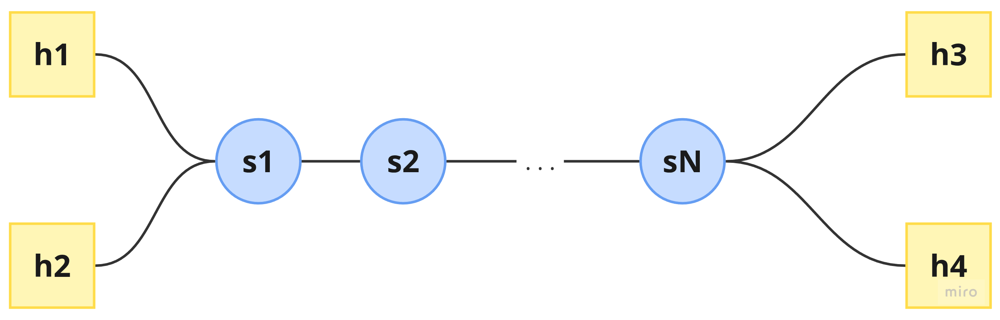

# TP Nº2: Software-Defined Networks

**Materia:** Redes (TA048)

**Cátedra:** Juan Ignacio Lopez Pecora y Agustín Horn

**Fecha de entrega:** 25/11/2025

**Facultad de Ingeniería – Universidad de Buenos Aires**

**Integrantes:**

- Valentina Llanos Pontaut
- Milton Formiga
- María Agustina Fontana 
- Santiago Novaro
- Franco Daniel Capra

Este documento describe cómo levantar el controlador POX con firewall y la topología en Mininet, indicando los parámetros de ejecución, sus valores por defecto y el orden recomendado de ejecución

## Archivos y estructura

Se cuenta con la siguiente estructura:

```text
~/pox/
  └─ pox/
     └─ ext/
        ├─ firewall.py        # Módulo del firewall (controlador)
        └─ rules_file.json    # Archivo de reglas del firewall
~/topologia.py                # Script de Mininet con la topología
```

## Ejecución del controlador POX

El controlador se basa en dos módulos:

- `ext.firewall`: aplica las reglas de firewall sobre un único switch (identificado por su dpid)

- `forwarding.l2_learning`: implementa el comportamiento de switch de capa 2 con aprendizaje (L2 learning)

### Comando de ejecución

```bash
./pox/pox.py log.level --DEBUG ext.firewall --rules=rules_file.json --dpid=2 forwarding.l2_learning
```
> **Orden de carga:** `ext.firewall` debe aparecer antes que `forwarding.l2_learning`, para que el firewall pueda inspeccionar los paquetes y, si corresponde, detener su procesamiento (`event.halt = True`) antes de que los maneje el módulo de L2 learning.

### Parámetros y flags

A continuación se describen los parámetros de este comando:

`log.level --DEBUG`

- Obligatorio: no

- Descripción: configura el nivel de log global de POX.

- Valor por defecto: si no se indica, el nivel típico es INFO.

- Uso recomendado: --DEBUG para obtener más detalle en los logs y poder contrastarlos con las capturas de Wireshark.

`ext.firewall`

- Obligatorio: si

- Descripción: módulo de POX ubicado en pox/ext/firewall.py

  - Carga las reglas desde el archivo JSON indicado por --rules

  - Escucha eventos PacketIn

  - Aplica las reglas únicamente en el switch cuyo identificador coincide con --firewall_dpid

  - Si un paquete matchea alguna regla, se lo bloquea usando event.halt = True

`--rules=rules_file.json`

- Obligatorio: no (pero requerido por la consigna del TP)

- Descripción: nombre del archivo JSON que contiene las reglas del firewall

- Ámbito: se interpreta relativo al directorio del módulo (pox/ext/)

- Valor por defecto: rules_file.json (según la firma de launch en firewall.py)

`--firewall_dpid=2`

- Obligatorio: no, pero es la forma explícita de indicar qué switch actuará como firewall

- Descripción: identifica el switch (por su dpid) sobre el que se aplicarán las reglas de firewall

- Valor por defecto: 1 (switch con dpid=1, típicamente s1), según el valor por defecto del parámetro en launch

`forwarding.l2_learning`

- Obligatorio: no desde el punto de vista de POX, pero sí en este diseño

- Descripción: módulo estándar de POX que:

  - Aprende qué MAC está por qué puerto

  - Instala reglas de forwarding (flow entries) en los switches

  - Interacción con el firewall:

    - Si ext.firewall bloquea un paquete, marca event.halt = True y forwarding.l2_learning no lo procesa

    - Si el firewall no bloquea, forwarding.l2_learning maneja el paquete normalmente

## Ejecución de la topología en Mininet

El archivo topologia.py define la clase `ChainTopo` y un main que permite parametrizar la topología y el controlador remoto

### Comando de ejecución

En otra terminal (mientras POX está corriendo), desde el directorio donde se encuentre topologia.py:

```bash
sudo python3 topologia.py --switches 3 --ctrl-ip 127.0.0.1 --ctrl-port 6633
```
> Se pueden omitir parámetros que se deseen dejar con su valor por defecto

### Parámetros del script de topología

`--switches`

- Obligatorio: no.

- Tipo: entero.

- Descripción: cantidad de switches en la cadena.

- Valor por defecto: 3.

- Efecto: crea la topología:

  - Hosts:

    - h1 (10.0.0.1/24) y h2 (10.0.0.2/24) conectados al primer switch (s1).

    - h3 (10.0.0.3/24) y h4 (10.0.0.4/24) conectados al último switch (sN).

  - Switches:

    - s1, s2, …, sN conectados en cadena.

    - Cada switch se crea con dpid=f"{i:016x}", de modo que:

      - s1 → dpid = 1

      - s2 → dpid = 2

      - s3 → dpid = 3

      - etc.

<p align="center">
  
</p>

`--info`

- Obligatorio: no

- Tipo: flag (sin valor)

- Descripción: si se incluye, muestra:

  - Configuración de interfaces (ifconfig) de cada host

  - Configuración de colas (tc qdisc show) de hosts y switches

-  Valor por defecto: False (no se muestra información extra)

`--ctrl-ip`

- Obligatorio: no

- Tipo: string (dirección IP)

- Descripción: IP del controlador remoto

- Valor por defecto: 127.0.0.1

- Requisito: debe coincidir con la IP donde se está ejecutando POX (si todo corre en la misma VM/máquina, se mantiene en 127.0.0.1)

`--ctrl-port`

- Obligatorio: no

- Tipo: entero

- Descripción: puerto TCP donde escucha el controlador remoto

- Valor por defecto: 6633 (puerto clásico para OpenFlow/POX)

- Requisito: debe coincidir con el puerto configurado en POX (por defecto también 6633)

## Flujo de ejecución recomendado

1. Iniciar POX con el firewall y L2 learning

```bash
./pox/pox.py log.level --DEBUG ext.firewall --rules=rules_file.json --firewall_dpid=2 forwarding.l2_learning
```

2. Iniciar la topología en Mininet

```bash
sudo python3 topologia.py --switches 3 --ctrl-ip 127.0.0.1 --ctrl-port 6633
```

3. Realizar pruebas desde el CLI de Mininet

```bash
mininet> pingall
mininet> iperf h1 h3
```

4. Finalizar

- Salir del CLI de Mininet con `exit`

- Detener POX con Ctrl+C